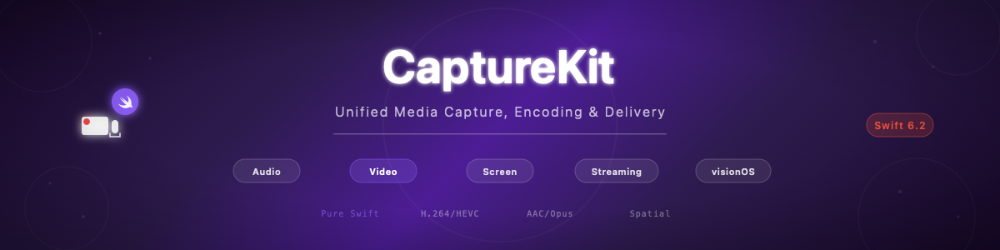

# swift-capture-kit

[](https://github.com/atelier-socle/swift-capture-kit/actions/workflows/ci.yml)
[](https://codecov.io/github/atelier-socle/swift-capture-kit)
[](https://swift.org)
[]()
[](https://atelier-socle.github.io/swift-capture-kit/documentation/capturekit/)
[](LICENSE)



Unified media capture, encoding, and delivery for Apple platforms. Part of the [Atelier Socle](https://www.atelier-socle.com) streaming ecosystem.

## Features

- **Every audio source** — microphone, line-in, system audio, Bluetooth, aggregate devices, file, VoIP, tone/silence generators
- **Every video source** — built-in/external cameras, cinematic, spatial, multi-camera, screen capture (ScreenCaptureKit + ReplayKit), test patterns, file
- **Every Apple codec** — AAC (LC/HE/xHE), ALAC, Opus, FLAC, WAV, PCM, MP3 (audio) / H.264, HEVC, ProRes, AV1, MV-HEVC, JPEG (video)
- **Flexible outputs** — file recording (MP4, MOV, M4A, CAF, WAV, AIFF, FLAC), callbacks, audio preview
- **Live streaming** — transport-agnostic `StreamingPipeline` with audio-only, video-only, and muxed modes
- **Audio metering** — real-time peak/RMS, EBU R128 loudness, waveform data for visual rendering
- **Device discovery** — monitor audio/video device connections and changes in real time
- **Permission management** — unified API + SwiftUI views for microphone, camera, and screen recording
- **Platform presets** — Twitch, YouTube, Facebook, Instagram, TikTok, podcast, radio
- **Adaptive quality** — automatic bitrate/resolution adjustment based on transport quality
- **Spatial video** — MV-HEVC encoding for visionOS
- **Pure Swift concurrency** — actors, AsyncStream, Sendable everywhere, zero Combine, zero dependencies

## Platform Support

| Platform | Minimum Version | Status |
|----------|----------------|--------|
| macOS    | 14.0           | Full support |
| iOS      | 17.0           | Full support |
| iPadOS   | 17.0           | Full support |
| visionOS | 1.0            | Full support (spatial video) |

## Installation

### Swift Package Manager

Add to your `Package.swift`:

```swift
dependencies: [
    .package(url: "https://github.com/atelier-socle/swift-capture-kit.git", from: "0.1.0"),
]
```

Then add `CaptureKit` to your target dependencies:

```swift
.target(
    name: "MyApp",
    dependencies: [
        .product(name: "CaptureKit", package: "swift-capture-kit"),
    ]
),
```

## Quick Start

### Record audio to file

```swift
import CaptureKit

let session = CaptureSession()
session.audioSource = MicrophoneSource()
session.audioEncoder = AACEncoder(configuration: .podcast)

let output = FileOutput(url: recordingURL, container: .m4a)
try await session.addOutput(output)
try await session.start()

// ... record ...

await session.stop()
```

### Record audio + video

```swift
let session = CaptureSession()
session.audioSource = MicrophoneSource()
session.audioEncoder = AACEncoder(configuration: .podcast)
session.videoSource = CameraSource()
session.videoEncoder = H264Encoder(configuration: .streaming1080p)

let output = FileOutput(url: videoURL, container: .mp4)
try await session.addOutput(output)
try await session.start()
```

### Live stream (muxed audio + video)

```swift
let pipeline = StreamingPipeline(
    mode: .muxed(
        videoSource: CameraSource(),
        videoEncoder: H264Encoder(configuration: .streaming720p),
        audioSource: MicrophoneSource(),
        audioEncoder: AACEncoder(configuration: .podcast)
    ),
    transport: rtmpBridge  // Your StreamingTransport implementation
)
try await pipeline.start()
```

### Audio-only Icecast stream

```swift
let pipeline = StreamingPipeline(
    mode: .audioOnly(
        source: MicrophoneSource(),
        encoder: MP3Encoder(configuration: .webRadio)
    ),
    transport: icecastBridge
)
try await pipeline.start()
```

### Use a platform preset

```swift
let config = CapturePreset.twitch(resolution: .p720, frameRate: .fps30)
let session = CaptureSession.configured(with: config)
```

### Monitor audio levels

```swift
let meter = AudioMeter(configuration: .broadcast)
await meter.start()

for await level in meter.levels {
    print("Peak: \(level.peakLevel) dBFS, RMS: \(level.rmsLevel) dBFS")
}
```

### Monitor session events

```swift
for await event in session.events {
    switch event {
    case .stateChanged(let state):
        print("State: \(state)")
    case .statisticsUpdated(let stats):
        print("Uptime: \(stats.uptime)s, FPS: \(stats.currentFrameRate)")
    case .permissionDenied(let type):
        print("Permission denied: \(type)")
    default:
        break
    }
}
```

## Architecture

```
Source → Encoder → Output
  ↓        ↓         ↓
Audio    AAC/ALAC   File (MP4, MOV, M4A, CAF, WAV, AIFF, FLAC)
Video    H264/HEVC  Callback
Screen   ProRes     StreamingPipeline → StreamingTransport
```

### Core Types

| Type | Role |
|------|------|
| `CaptureSession` | Main orchestrator (actor) |
| `AudioSource` / `VideoSource` | Capture protocols |
| `AudioEncoderProtocol` / `VideoEncoderProtocol` | Encoding protocols |
| `CaptureOutput` | Output delivery protocol |
| `StreamingPipeline` | Unified capture → encode → send pipeline (actor) |
| `StreamingTransport` | Transport-agnostic send protocol |
| `AudioMeter` | Real-time level metering (actor) |
| `PermissionManager` | Permission handling (actor) |
| `DeviceDiscovery` | Device monitoring (actor) |

### Streaming Integration

CaptureKit defines `StreamingTransport` — a minimal protocol with
`connect()`, `sendConfiguration(_:)`, `send(_:)`, and `disconnect()`.
Concrete bridge implementations live in consuming apps, keeping CaptureKit
transport-agnostic.

## Ecosystem

swift-capture-kit is part of the Atelier Socle streaming ecosystem:

| Library | Description |
|---------|-------------|
| [swift-hls-kit](https://github.com/atelier-socle/swift-hls-kit) | HLS manifest + packaging + live streaming + spatial |
| [swift-rtmp-kit](https://github.com/atelier-socle/swift-rtmp-kit) | RTMP publish client |
| [swift-srt-kit](https://github.com/atelier-socle/swift-srt-kit) | SRT transport (pure Swift) |
| [swift-icecast-kit](https://github.com/atelier-socle/swift-icecast-kit) | Icecast/SHOUTcast streaming client |
| [PodcastFeedMaker](https://github.com/atelier-socle/PodcastFeedMaker) | RSS feed generation/parsing |
| **swift-capture-kit** | **Unified media capture (this library)** |

## Documentation

Full API documentation is available via DocC:

```bash
swift package generate-documentation
```

Or browse online at [atelier-socle.github.io/swift-capture-kit](https://atelier-socle.github.io/swift-capture-kit/documentation/capturekit/).

## License

Apache License 2.0. See [LICENSE](LICENSE) for details.

Copyright 2026 Atelier Socle SAS
